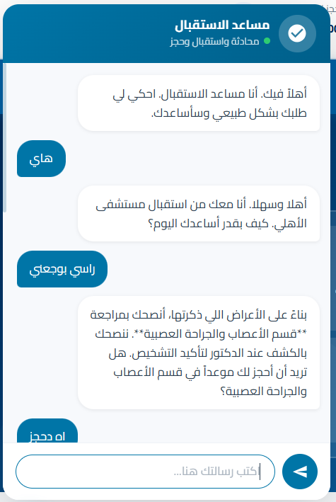
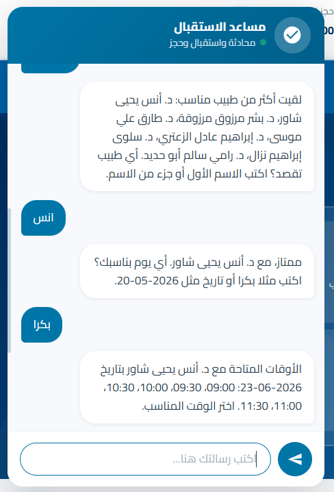

# Virtual Assistant for Al-Ahli Hospital

An Arabic-language AI receptionist chatbot for Al-Ahli Hospital, built with PHP and powered by an LLM orchestration layer. The chatbot understands Palestinian Arabic dialect and handles appointment booking, doctor inquiries, lab results, and general hospital knowledge — all through a natural conversation interface embedded in the hospital's web portal.

---

## Features

- **Arabic NLU** — Understands Palestinian/Levantine dialect with a custom text normalizer and token-based intent detection
- **Appointment Booking** — Full multi-step booking flow: specialty → doctor → date → time slot → OTP confirmation via email
- **Doctor Directory** — Queries doctor schedules, specialties, and bios directly from the database
- **Hospital Knowledge Base** — 1,000+ documents (static JSON + web-scraped cache) with whole-word Arabic scoring to answer questions about departments, services, and policies
- **Email OTP Verification** — Sends one-time passwords via SMTP (Gmail) to confirm patient identity before booking
- **Symptom Checker** — ML-based triage powered by a scikit-learn pipeline (Python FastAPI sidecar)
- **Safety Guard** — Detects and blocks out-of-scope or harmful messages before they reach the LLM
- **Staff Portals** — Separate dashboards for Admin, Doctors, and Lab technicians with role-based authentication

---

## Screenshots

| Symptom Detection | Appointment Booking |
|---|---|
|  |  |

---

## Tech Stack

| Layer | Technology |
|---|---|
| Backend | PHP 8, Apache (XAMPP) |
| Database | MySQL |
| AI / LLM | OpenRouter API (GPT-4.1-mini) |
| NLU Pipeline | Custom PHP rule-based intent detection |
| Symptom ML | Python, scikit-learn, FastAPI |
| Knowledge Base | Token-scored JSON documents (1,000+ entries) |
| Email | SMTP via Gmail App Password |
| Frontend | HTML5, CSS3, Vanilla JavaScript |

---

## System Architecture

```
User message
     │
     ▼
ReceptionistSafetyGuard       ← blocks harmful / off-topic input
     │
     ▼
LlmReceptionistOrchestratorService   ← main router
     │
     ├── isDoctorQuestion?    → DoctorRepository (MySQL)
     ├── isBookingRequest?    → Booking state machine (session)
     ├── isLabQuestion?       → LabTestRepository (MySQL)
     ├── isHospitalKnowledge? → HospitalWebsiteKnowledgeService (JSON scoring)
     └── fallback             → "out of scope" response
     │
     ▼
LlmReceptionistResponseBuilder   ← rewrites draft in natural Arabic via LLM
     │
     ▼
JSON response → chatbot UI
```

---

## Project Structure

```
hospital-chatbot/
├── app/
│   ├── config/          # env.php (local secrets, gitignored), database.php
│   ├── controllers/     # AppointmentController, AdminController, DoctorAuthController, LabController
│   ├── helpers/         # AdminAuth, DoctorAuth, LabAuth (role-based guards)
│   ├── ml/              # symptom_api.py (FastAPI), generate_and_train.py, trained models
│   ├── models/          # Doctor, Patient ORM models
│   ├── repositories/    # DoctorRepository, AppointmentRepository, LabTestRepository, PatientRepository
│   └── services/
│       ├── LlmReceptionistOrchestratorService.php   ← core chatbot logic
│       ├── ReceptionistToolService.php               ← intent detection methods
│       ├── HospitalWebsiteKnowledgeService.php       ← knowledge base search
│       ├── ReceptionistStateManager.php              ← session/state machine
│       ├── LlmReceptionistResponseBuilder.php        ← LLM response rewriter
│       ├── ReceptionistSafetyGuard.php               ← input safety filter
│       ├── ArabicPatientTextNormalizerService.php    ← dialect normalization
│       ├── EmailOtpService.php                       ← OTP generation & sending
│       └── SymptomCheckerService.php                 ← ML sidecar client
├── database/
│   ├── seed_real_data.sql       # hospital data (doctors, departments, slots)
│   ├── migration_news.sql
│   └── migration_photos.sql
├── frontend/
│   ├── index.html               # main hospital portal with embedded chatbot
│   ├── dashboard.html           # patient dashboard
│   ├── appointments.html
│   ├── doctors.html
│   ├── admin.html               # admin panel
│   ├── doctor-dashboard.html
│   └── lab-dashboard.html
├── public/
│   ├── index.php                # API router
│   └── assets/
│       ├── css/chatbot.css
│       ├── js/chatbot.js
│       └── images/doctors/      # doctor profile photos
├── routes/api.php
└── storage/
    ├── knowledge/ahli-chatbot-knowledge.json   # static knowledge base
    └── cache/ahli-website-knowledge.json       # web-scraped hospital pages
```

---

## Local Setup

### Requirements
- XAMPP (PHP 8.x + MySQL + Apache)
- Python 3.10+ (optional, for symptom checker)
- An [OpenRouter](https://openrouter.ai) API key

### Steps

1. **Clone the repo** into your XAMPP htdocs folder:
   ```bash
   git clone https://github.com/Hatemtarada2004/Virtual-Assistant-for-Al-Ahli-Hospital.git
   cd "C:\xampp\htdocs\Virtual-Assistant-for-Al-Ahli-Hospital"
   ```

2. **Import the database:**
   ```sql
   -- In phpMyAdmin or MySQL CLI, create a database named: ahli_hospital
   -- Then import:
   database/seed_real_data.sql
   database/migration_news.sql
   database/migration_photos.sql
   ```

3. **Configure environment:**
   ```bash
   cp app/config/env.example.php app/config/env.php
   # Edit env.php and fill in:
   #   db_password, openai_api_key, smtp_user, smtp_password
   ```

4. **Start XAMPP** (Apache + MySQL)

5. **Open the portal:**
   ```
   http://localhost/Virtual-Assistant-for-Al-Ahli-Hospital/frontend/index.html
   ```

6. **(Optional) Start the symptom checker sidecar:**
   ```bash
   cd app/ml
   pip install fastapi uvicorn scikit-learn
   python symptom_api.py
   ```

---

## How the Chatbot Works

1. **Normalization** — `ArabicPatientTextNormalizerService` strips diacritics, normalizes hamza variants, and maps Palestinian dialect words to standard forms (e.g. "شو" → "ما", "وين" → "أين")

2. **Safety check** — `ReceptionistSafetyGuard` scans for off-topic or harmful content before any processing

3. **Intent routing** — `ReceptionistToolService` runs ~15 rule-based checks (`isBookingRequest`, `isDoctorQuestion`, `isLabQuestion`, etc.) using keyword lists tuned for Arabic dialect

4. **Knowledge search** — For general questions, `HospitalWebsiteKnowledgeService` scores 1,000+ documents using whole-word token matching with Arabic stop-word filtering, then picks the top result

5. **State machine** — Booking conversations are managed through a session-stored state (`stage`: specialty → doctor → date → slot → otp → confirmed)

6. **LLM rewrite** — Draft responses pass through `LlmReceptionistResponseBuilder` which calls GPT-4.1-mini via OpenRouter to produce natural, fluent Arabic replies

---

## Staff Portals

| Portal | URL | Access |
|---|---|---|
| Patient | `/frontend/index.html` | Public |
| Admin | `/frontend/admin-login.html` | Admin account |
| Doctor | `/frontend/doctor-login.html` | Doctor account |
| Lab | `/frontend/lab-login.html` | Lab technician account |

---

## API

**Chat endpoint:**
```
POST /public/api/chat
Content-Type: application/json

{ "message": "بدي أحجز موعد", "chat_page_id": "page_123" }
```

**Response:**
```json
{
  "success": true,
  "intent": "booking_start",
  "message": "تمام! أي تخصص بدك؟",
  "data": { "quick_replies": ["باطنية", "عظام", "قلب"] }
}
```

---

## Security Notes

- `app/config/env.php` is **gitignored** — never committed
- All OTP codes expire after 10 minutes
- Role-based authentication guards protect admin/doctor/lab routes
- Input sanitized before all database queries

---

## License

MIT License — feel free to use, modify, and distribute.
